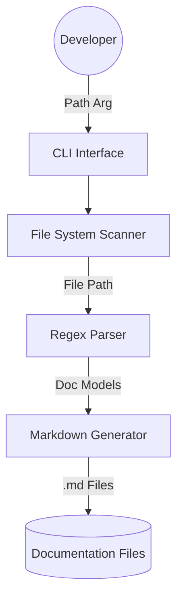

<div id="top" align="center">
<h1>cxx_docu_gen</h1>

<p>C++23 Documentation Generator</p>


[](https://github.com/Zheng-Bote/cxx_docu_gen/releases)
<br/>
[Report Issue](https://github.com/Zheng-Bote/cxx_docu_gen/issues) · [Request Feature](https://github.com/Zheng-Bote/cxx_docu_gen/pulls)

</div>

---

<!-- START doctoc generated TOC please keep comment here to allow auto update -->
<!-- DON'T EDIT THIS SECTION, INSTEAD RE-RUN doctoc TO UPDATE -->
**Table of Contents**

- [Description](#description)
- [Documentation Overview](#documentation-overview)
- [Architecture Overview](#architecture-overview)
  - [Bounded Context Diagram](#bounded-context-diagram)
- [Getting Started](#getting-started)
  - [Prerequisites](#prerequisites)
  - [Build and Run](#build-and-run)
- [📄 License](#-license)
- [🤝 Authors](#-authors)

<!-- END doctoc generated TOC please keep comment here to allow auto update -->

---

## Description

A high-performance command-line tool written in C++23 designed to recursively parse source code (`src/*.cpp` and `include/*.hpp`), extract Doxygen-style comments and SPDX file headers, and generate structured Markdown documentation.

## Documentation Overview

This project follows a strict documentation-first approach. All source files are documented using Doxygen blocks, which are then processed by this tool itself to generate the `docs/source_docu` directory.

- **Source Documentation**: Located in `docs/source_docu/`, mirroring the project structure.
- **Architecture**: Detailed diagrams and design decisions are found in `docs/architecture/`.
- **Developer Guide**: New developers should start by reviewing the [Architecture Documentation](docs/architecture/architecture_doc.md).

## Architecture Overview

The tool is built as a modular pipeline:

1. **Discovery**: Recursively scans `src` and `include` directories.
2. **Parsing**: A regex-based engine extracts metadata from file headers and code blocks.
3. **Generation**: Formats the extracted models into clean, GitHub-flavored Markdown.

### Bounded Context Diagram



## Getting Started

### Prerequisites

- **Compiler**: GCC 13+, Clang 16+, or MSVC 19.38+ (C++23 support required).
- **Build System**: CMake 3.28+.

### Build and Run

```bash
cmake -S . -B build -DCMAKE_BUILD_TYPE=Release
cmake --build build -j"$(nproc)"
cd build && sudo make install
cxx_docu_gen [optional/source/path]
```

## 📄 License

This project is licensed under the **MIT** license.

Copyright (c) 2026 ZHENG Robert

## 🤝 Authors

- [](https://www.github.com/Zheng-Bote)

---

:vulcan_salute:

<p align="right">(<a href="#top">back to top</a>)</p>
