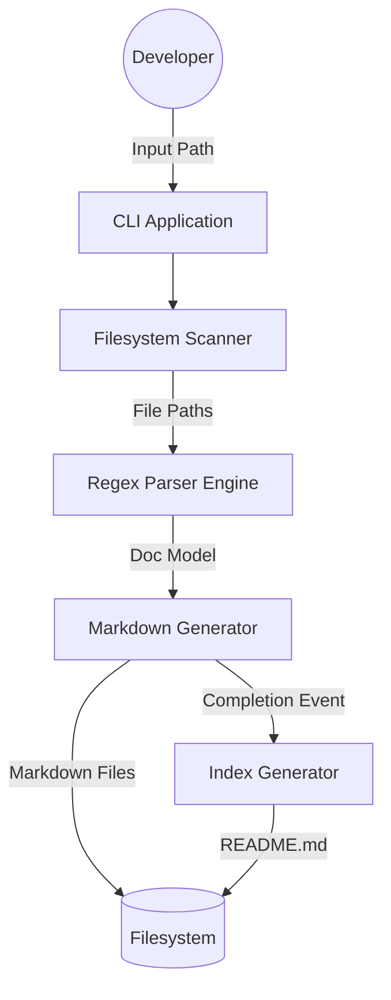
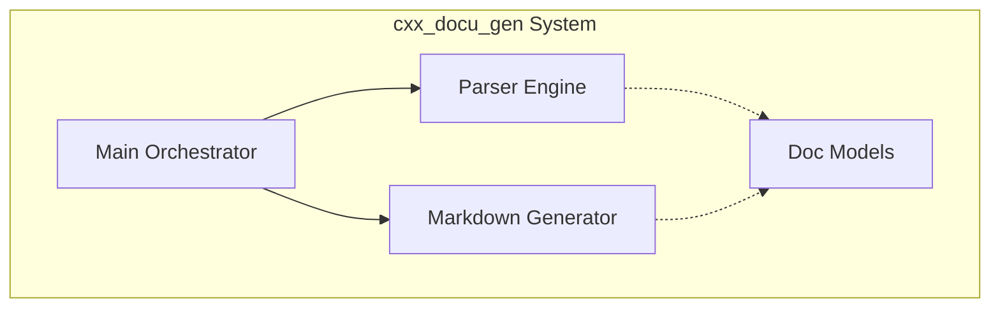
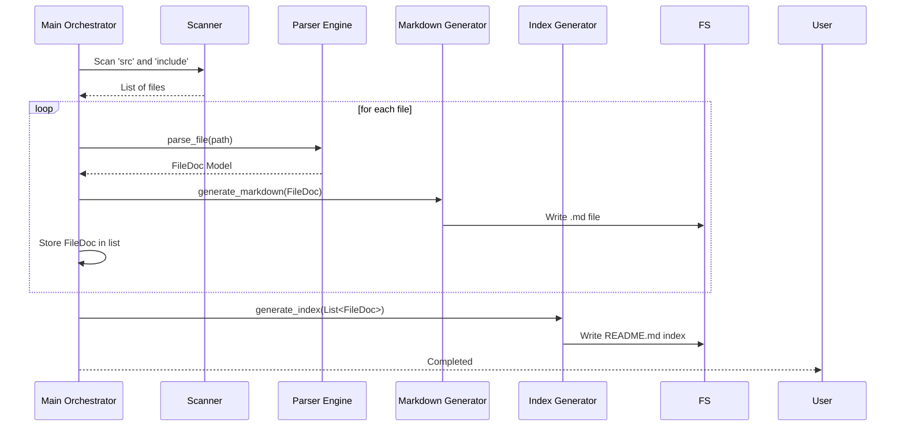
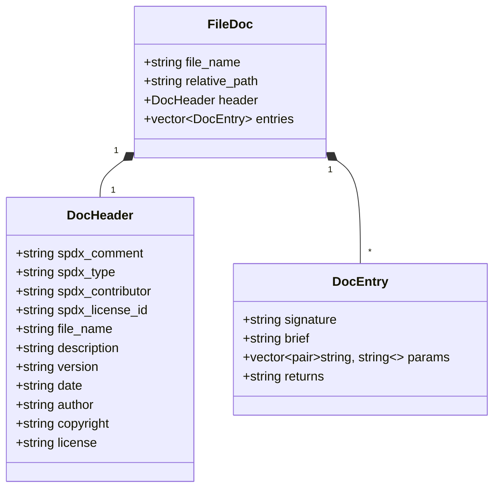

# Architecture Documentation - cxx_docu_gen

## Overview

The `cxx_docu_gen` is a C++23-based documentation tool that extracts Doxygen comments and SPDX headers from source files and generates structured Markdown documentation.

---

<!-- DOCTOC SKIP -->
<!-- START doctoc -->

---

## Bounded Context Diagram

## Component Diagram

The system consists of three main components:

- **Parser Engine (`parser_util`)**: Responsible for reading file contents and using regex patterns to extract documentation metadata.
- **Markdown Generator (`markdown_generator_util`)**: Responsible for formatting the extracted metadata into human-readable Markdown.
- **CLI Orchestrator (`main`)**: Manages the overall workflow, including directory scanning and execution of the parser and generator.

## Sequence Diagram

## Class Diagram (Data Models)

## Design Decisions

- **C++23 Standard**: Utilizes modern features like `std::print` for performance, `std::expected` for robust error handling, and `std::filesystem` for platform-agnostic file operations.
- **Regex-based Parsing**: Provides a lightweight alternative to full AST parsing while remaining effective for structured comments (Doxygen/SPDX).
- **Separation of Concerns**: Parsing logic is completely decoupled from formatting logic, allowing for future support of different output formats (e.g., HTML, JSON).
- **Index Generation**: Added in v1.1.0 to provide a central navigation point for the generated documentation.

---

_Generated by cxx_docu_gen (Self-Documented)_
