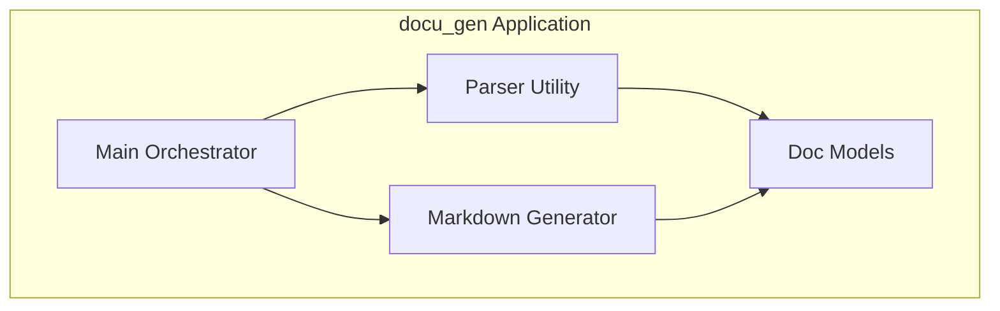
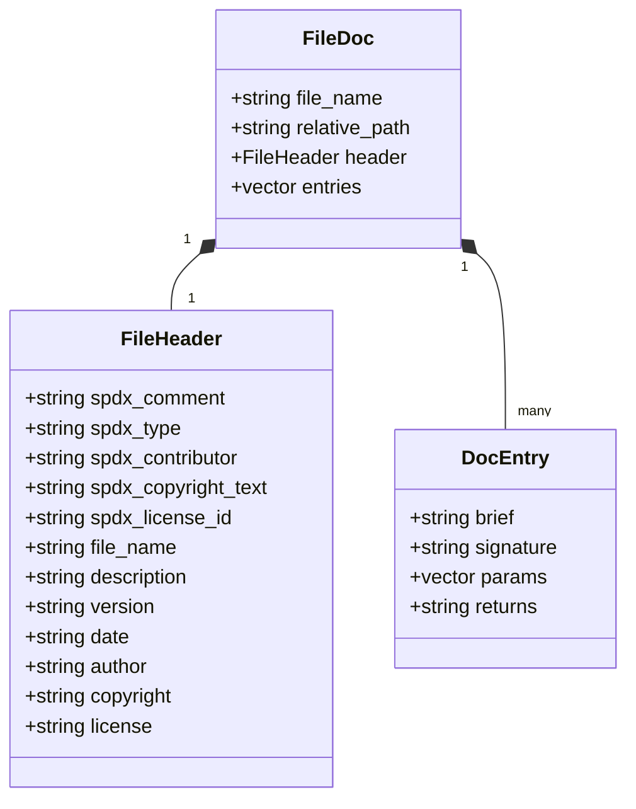
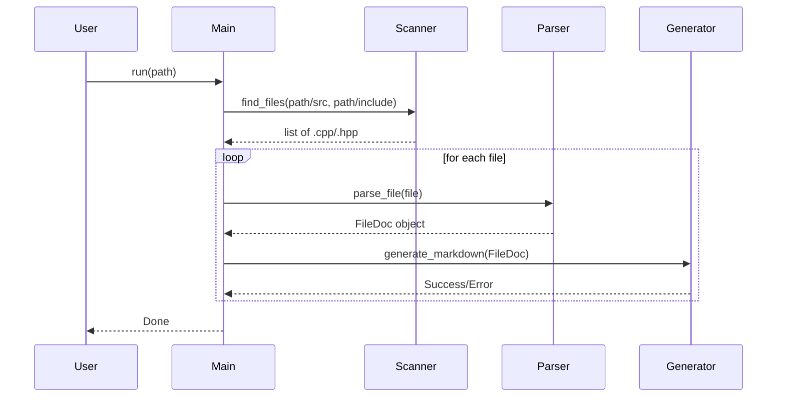

<!-- START doctoc generated TOC please keep comment here to allow auto update -->
<!-- DON'T EDIT THIS SECTION, INSTEAD RE-RUN doctoc TO UPDATE -->
**Table of Contents**

- [Architecture Documentation](#architecture-documentation)
  - [Component Diagram](#component-diagram)
  - [Class Diagram](#class-diagram)
  - [Sequence Diagram (Execution Flow)](#sequence-diagram-execution-flow)

<!-- END doctoc generated TOC please keep comment here to allow auto update -->

# Architecture Documentation

## Component Diagram

## Class Diagram

## Sequence Diagram (Execution Flow)

